# Music Bot

A production-grade Discord music bot — TypeScript + discord.js + Lavalink 4 — with a **Canvas UI** that renders the Now Playing / Queue panels as images instead of plain text embeds.

> Status: built phase by phase. See the [Roadmap](#roadmap).

## Two card styles

The `sakura` variant composites live player state onto an illustrated pastel template — only the cover, title, artist, source badge, progress, timestamps and the transport glyph are repainted, so the artwork keeps its hand-made look:

| Playing                             | Paused                                     |
| ----------------------------------- | ------------------------------------------ |
| 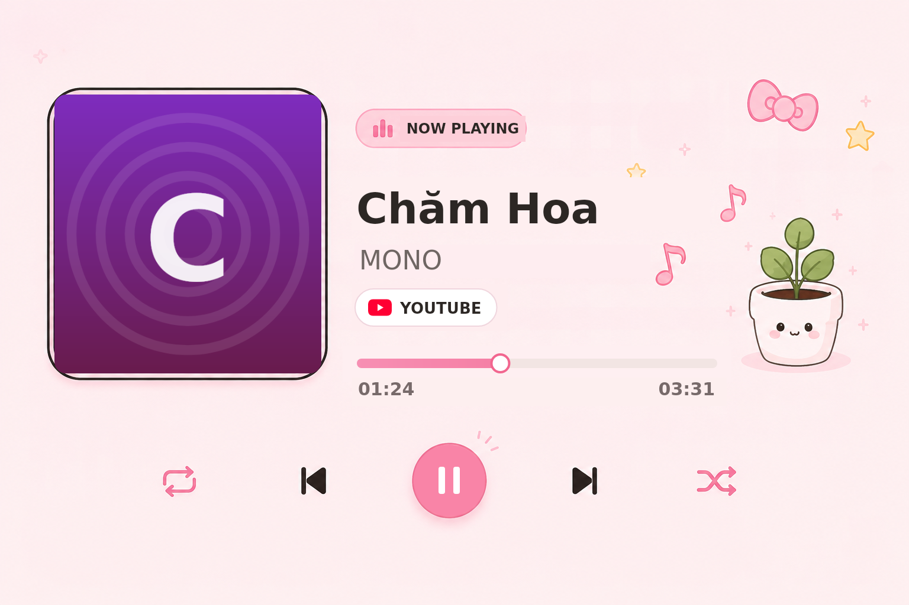 | 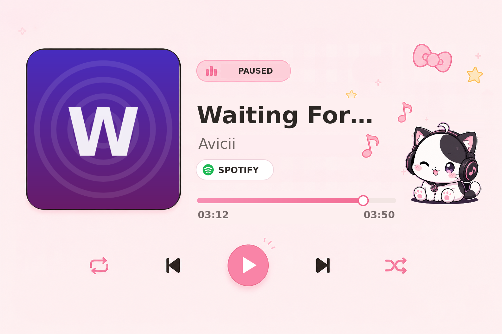 |

The queue has a template too. Its five rows are filled from the live queue — cover art, titles, real positions, and durations — and any rows the page does not fill are cleared:

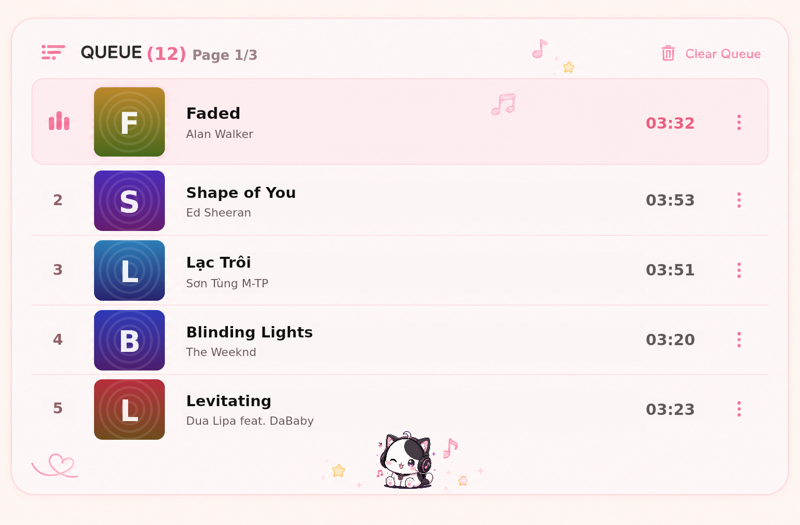

Long queues page through it. The current track keeps the highlighted first row on every page and the other four rows advance, so a button handler re-renders the image for the new page:

```ts
const slice = paginateSakuraQueue(queue.tracks, page); // 4 upcoming per page
await renderQueueCard({
  current,
  tracks: slice.items.map((track, i) => ({ position: slice.firstPosition + i + 1, ...track })),
  page: slice.page,
  totalPages: slice.totalPages,
  variant: 'sakura',
});
```

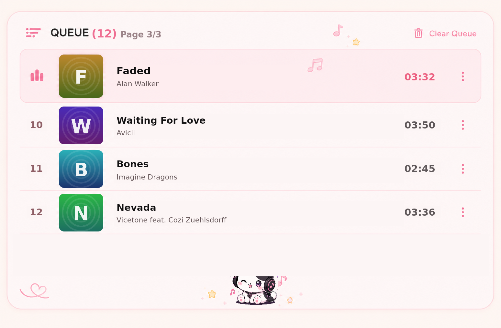

The command list too. Its sidebar, highlight, rows and every icon come from the catalog — the icons are drawn, not taken from the artwork, so `/shuffle` never inherits a pause symbol:

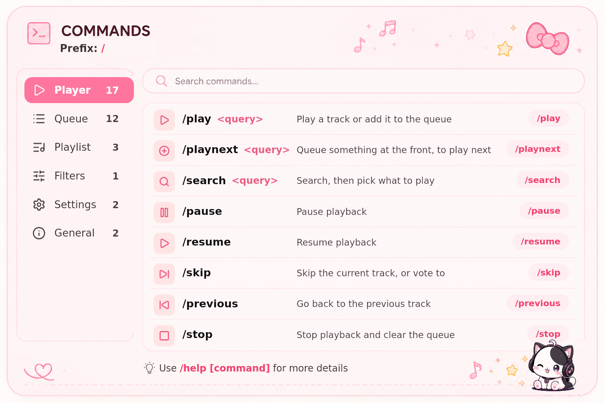

The playlist library is drawn entirely in code — no template behind it — with its own pastel stickers, so it sits alongside the template-backed cards without one:

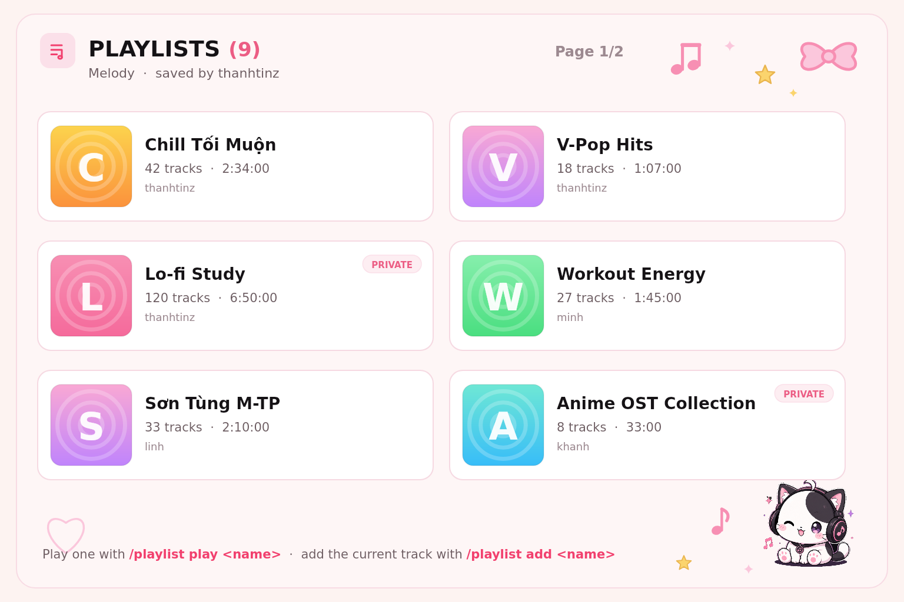

```ts
await renderNowPlayingCard({ ...playerState, variant: 'sakura' });
await renderQueueCard({ ...queueState, variant: 'sakura' });
await renderSakuraHelpCard({ categories, activeCategory, commands, prefix });
await renderSakuraPlaylistCard({ entries, ownerName, page, totalPages, prefix });
```

Swapping either template means re-measuring the region coordinates in `src/ui/canvas/cards/now-playing-sakura.card.ts` and `queue-sakura.card.ts`; they are pixel measurements of those specific images. Note the two queue variants page differently — the classic list fits 10 rows, the illustrated one 5.

## The classic variant: a canvas-rendered UI

Every panel the user sees is rendered server-side with [`@napi-rs/canvas`](https://github.com/Brooooooklyn/canvas) and sent to Discord as a PNG:

- Rounded cover art over an ambient background blurred from that same artwork
- A deterministic waveform per track — the same track always renders the same silhouette
- Gradient progress bar, source badge, and a state bar (requester / volume / loop / queue / filter)
- Three themes: `midnight`, `sunset`, `forest`
- Full Unicode text support, including Vietnamese diacritics

| Playing                              | Paused                              | Radio / live stream                |
| ------------------------------------ | ----------------------------------- | ---------------------------------- |
| 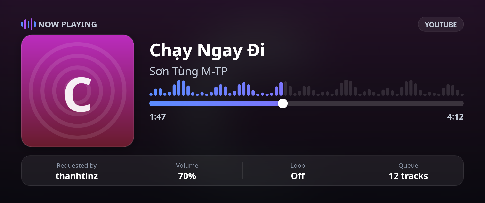 | 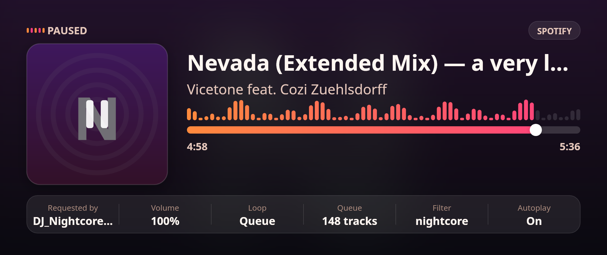 | 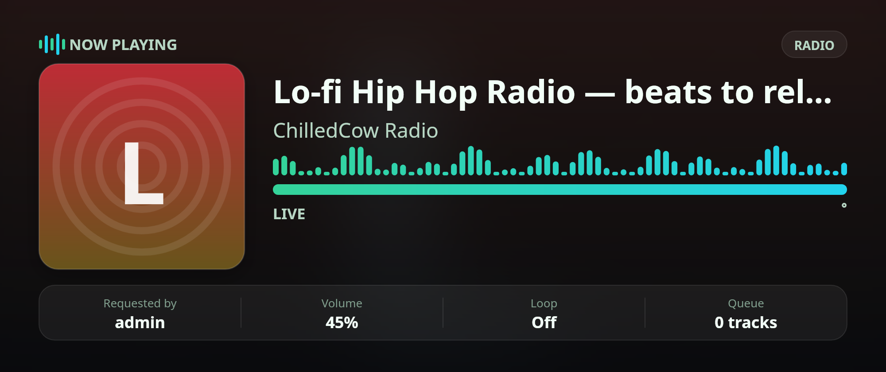 |

The queue is rendered the same way — a paginated list card that grows with the page:

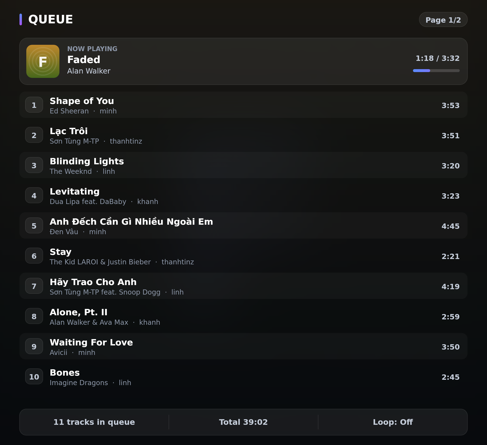

Cards render straight from a live `player.snapshot()`, so what you see is real player state:

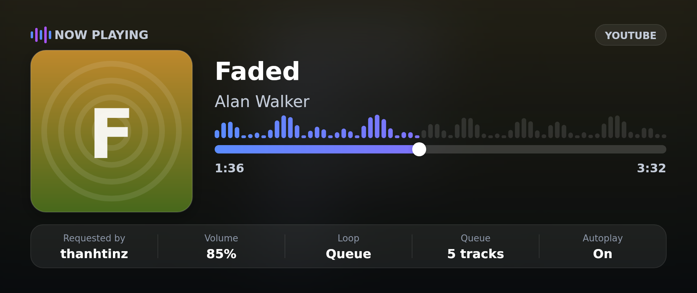

Help is generated straight from the command catalog:

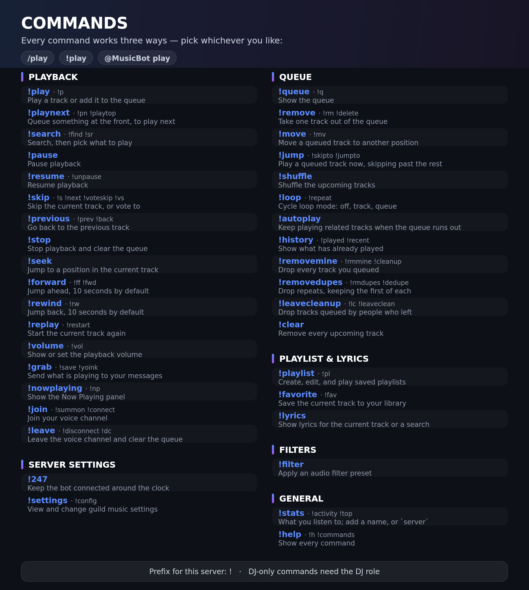

## Running the bot

You need a Discord application and a Lavalink 4 node. `docker compose` brings up the node for you.

```bash
npm install
cp .env.example .env       # fill in DISCORD_TOKEN and DISCORD_CLIENT_ID

docker compose up -d lavalink   # audio node on 127.0.0.1:2333
npm run dev                     # bot, with reload
```

Or run both in Docker:

```bash
docker compose up -d --build
```

In the [Discord developer portal](https://discord.com/developers/applications) the bot needs:

- the **Message Content** privileged intent — without it only slash commands and `@Bot` mentions arrive
- the **Connect** and **Speak** permissions in the voice channels it should join

Set `DISCORD_DEV_GUILD_ID` while developing: guild commands appear immediately, global ones can take an hour.

### Reviewing the UI without a bot

```bash
npm run preview:canvas    # render every card into preview/
npm test                  # unit tests
npm run typecheck
```

`npm run preview:canvas` needs no Discord token and no Lavalink node — it exists so the UI can be reviewed while iterating on the design.

## Layout

```
src/
├── application/
│   ├── commands/    # command engine: parser, registry, router, cooldowns
│   ├── player/      # per-guild Player and the PlayerManager that serialises it
│   └── services/    # MusicService — what every interface actually calls
├── commands/        # catalog (the shared matrix) and its handlers
├── config/          # environment loading and validation (zod)
├── domain/music/    # Track and Queue — no Discord or Lavalink types
├── resolvers/       # URL parsing, source resolvers, circuit breaker, registry
├── infrastructure/
│   ├── audio/       # AudioBackend seam — the audio engine behind an interface
│   ├── discord/     # client, contexts, buttons, permissions, slash registration
│   └── lavalink/    # Lavalink backend, filter presets, node balancing
├── telemetry/       # JSON logger with secret redaction
└── ui/canvas/       # canvas UI engine
    ├── theme.ts        # color tokens and themes
    ├── fonts.ts        # font registration (bundled → system)
    ├── primitives.ts   # rounded rects, gradients, text truncation/wrapping, durations
    ├── artwork.ts      # artwork loading (host allowlist) + generated placeholder
    ├── glyphs.ts       # line-art command icons drawn from paths
    ├── stickers.ts     # pastel decorations for the code-drawn cards
    └── cards/          # one module per card
scripts/             # dev tooling (canvas preview)
tests/               # unit tests
```

## Saved playlists

`playlist` works over slash, prefix and the library card's page buttons:

| Action                            | What it does                                         |
| --------------------------------- | ---------------------------------------------------- |
| `playlist list`                   | Renders your library as a card, paged by its buttons |
| `playlist create <name>`          | Creates an empty playlist                            |
| `playlist add <name>`             | Adds the current track, creating the playlist if new |
| `playlist play <name>`            | Queues every track in it                             |
| `playlist remove <name> <n>`      | Removes track `n`, counting from 1                   |
| `playlist delete <name>`          | Deletes the playlist                                 |
| `playlist public\|private <name>` | Changes who can see it                               |

Names are matched case- and whitespace-insensitively, so `chill vibes` finds `Chill  Vibes`. Limits are 25 playlists per person per guild and 500 tracks each.

A playlist stores what it takes to rebuild a track, not the track object — the per-enqueue id and the original requester do not survive being saved, so a replayed track is attributed to whoever played it.

Storage is behind a port (`PlaylistRepository`), so it can move to PostgreSQL in F8 without the command layer changing. Until then `PLAYLIST_STORE_PATH` writes a JSON file — whole-file writes, moved into place with a rename, so a crash cannot leave half a library. Blank the variable to keep playlists in memory instead and lose them on restart.

## Customising the look

- **Fonts:** drop a `.ttf`/`.otf` into `assets/fonts/` — no code change needed.
- **Colors:** add a theme in `src/ui/canvas/theme.ts`.
- **Artwork:** only fetched from the host allowlist in `src/ui/canvas/artwork.ts` (SSRF guard). Unknown hosts and failed downloads fall back to a gradient cover generated from the track name.

## Roadmap

| Phase | Scope                                                                    | Status  |
| ----- | ------------------------------------------------------------------------ | ------- |
| F1    | Project skeleton, config, logger, **canvas UI + Now Playing card**       | ✅ done |
| F2    | Domain: track and queue (loop, shuffle, history, snapshots) + queue card | ✅ done |
| F3    | Unified command engine (slash + prefix + @mention) + help card           | ✅ done |
| F4    | Player, player manager, audio-backend seam, node balancing               | ✅ done |
| F5    | Resolvers: URL parsing, YouTube / Spotify metadata / radio, breaker      | ✅ done |
| F6    | **Discord + Lavalink wiring**: live commands, buttons, filters, Docker   | ✅ done |
| F7    | **Saved playlists**; favorites, lyrics, vote-skip                        | 🚧      |
| F8    | PostgreSQL + Redis, 24/7, state recovery                                 | ⏳      |
| F9    | Lavalink cluster, failover, metrics, dashboard                           | ⏳      |

## License

MIT © thanhtinz
