# Music Bot

A production-grade Discord music bot — TypeScript + discord.js + Lavalink 4 — with a **Canvas UI** that renders the Now Playing / Queue panels as images instead of plain text embeds.

> Status: built phase by phase. See the [Roadmap](#roadmap).

## Two card styles

The `sakura` variant composites live player state onto an illustrated pastel template — only the cover, title, artist, source badge, progress, timestamps and the transport glyph are repainted, so the artwork keeps its hand-made look:

| Playing                             | Paused                                     |
| ----------------------------------- | ------------------------------------------ |
|  |  |

### The controls under a Now Playing panel

Four buttons and a dropdown, and nothing else: **previous**, **play/pause**, **skip**, **mute**, and a volume picker.

| Component    | What it does                                                                            |
| ------------ | --------------------------------------------------------------------------------------- |
| ⏮️ / ⏭️      | Steps through history and queue; disabled when there is nothing either way              |
| ⏸️ / ▶️      | Pauses or resumes, and swaps its own glyph                                              |
| 🔊 / 🔇      | Mutes, and brings the volume back to the level it left rather than to a default         |
| `Volume: n%` | Sets one of 10 / 25 / 50 / 75 / 100 / 150 / 200 — finer levels are what `volume` is for |

Everything else — shuffle, loop, autoplay, stop, favourite — stays a command, so the panel keeps one row of controls instead of two rows of buttons nobody presses. Both a mute and a pick redraw the panel: the level lives in the picker's placeholder, so leaving it stale would have the menu claim a volume the player is no longer at.

The queue has a template too. Its five rows are filled from the live queue — cover art, titles, real positions, and durations — and any rows the page does not fill are cleared:


Long queues page through it. The current track keeps the highlighted first row on every page and the other four rows advance, so a button handler re-renders the image for the new page:

```ts
const slice = paginateSakuraQueue(queue.tracks, page); // 4 upcoming per page
await renderQueueCard({
  current,
  tracks: slice.items.map((track, i) => ({ position: slice.firstPosition + i + 1, ...track })),
  page: slice.page,
  totalPages: slice.totalPages,
  variant: 'sakura',
});
```


The command list too. Its sidebar, highlight, rows and every icon come from the catalog — the icons are drawn, not taken from the artwork, so `/shuffle` never inherits a pause symbol:


The playlist library is drawn entirely in code — no template behind it — with its own pastel stickers, so it sits alongside the template-backed cards without one:


```ts
await renderNowPlayingCard({ ...playerState, variant: 'sakura' });
await renderQueueCard({ ...queueState, variant: 'sakura' });
await renderSakuraHelpCard({ categories, activeCategory, commands, prefix });
await renderSakuraPlaylistCard({ entries, ownerName, page, totalPages, prefix });
```

The cover fills its frame edge to edge, which took measuring the template rather than guessing at it: the frame's stroke runs 90–92 on the left, 160–162 on top, 550–552 on the right and 640–642 at the bottom, so the cover occupies 93–549 by 163–639 with a 40px radius to match the frame's own corners.

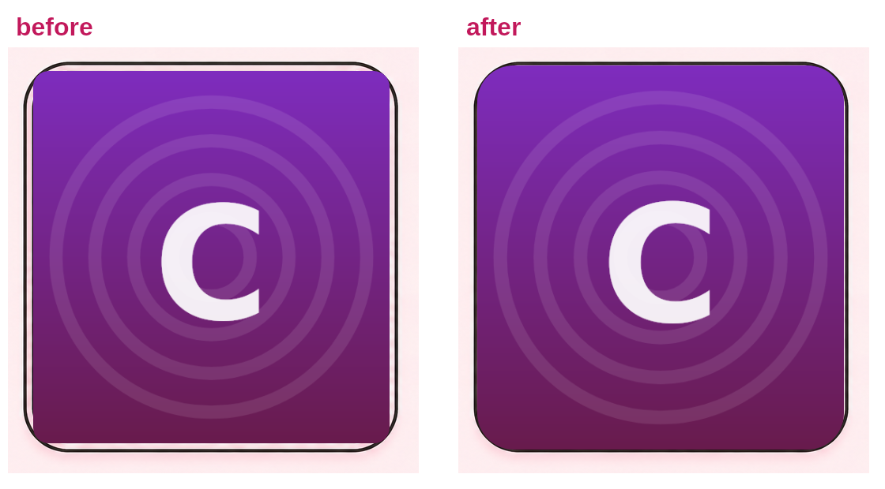

The old box stopped seven pixels short on the right and eight at the bottom — a picture too small for its frame. Filling the box without matching its radius then made the corners bulge past the arc, which looked worse than the gap. Two tests hold it: one walks the inside of each edge and fails on a strip of pale ground between frame and cover, the other compares the corners against the template's own pixels, since outside the arc the card must be exactly what the artwork drew.

Swapping either template means re-measuring the region coordinates in `src/ui/canvas/cards/now-playing-sakura.card.ts` and `queue-sakura.card.ts`; they are pixel measurements of those specific images. Note the two queue variants page differently — the classic list fits 10 rows, the illustrated one 5.

## The classic variant: a canvas-rendered UI

Every panel the user sees is rendered server-side with [`@napi-rs/canvas`](https://github.com/Brooooooklyn/canvas) and sent to Discord as an image:

- Rounded cover art over an ambient background blurred from that same artwork
- A deterministic waveform per track — the same track always renders the same silhouette
- Gradient progress bar, source badge, and a state bar (requester / volume / loop / queue / filter)
- Three themes: `midnight`, `sunset`, `forest`
- Full Unicode text support, including Vietnamese diacritics

| Playing                              | Paused                              | Radio / live stream                |
| ------------------------------------ | ----------------------------------- | ---------------------------------- |
|  |  |  |

The queue is rendered the same way — a paginated list card that grows with the page:


Cards render straight from a live `player.snapshot()`, so what you see is real player state:


Help is generated straight from the command catalog, and every category is reachable — `help filters`, `help 2`, or the buttons under the card:

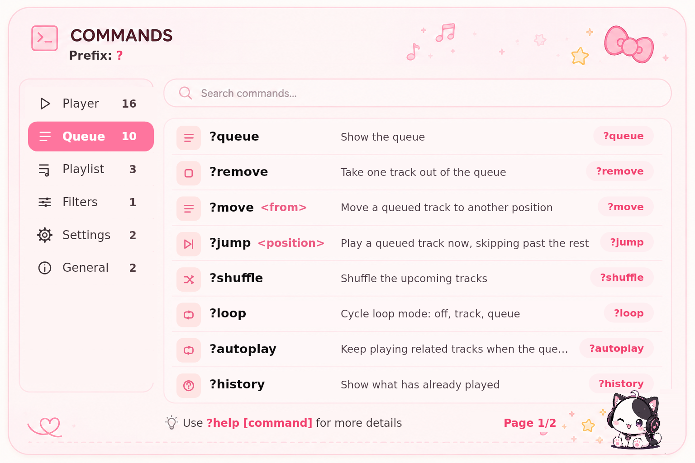

Every card names commands the way the person reached the bot: `/play` for a slash command, `?play` for a typed one, `@Melody play` for a mention. A card is an image, so each command it mentions has to be spelled out — and somebody who typed `@Melody help` has no prefix in their head, while a slash user may not know the guild has one at all.

| Slash                             | Mention                             |
| --------------------------------- | ----------------------------------- |
|  | 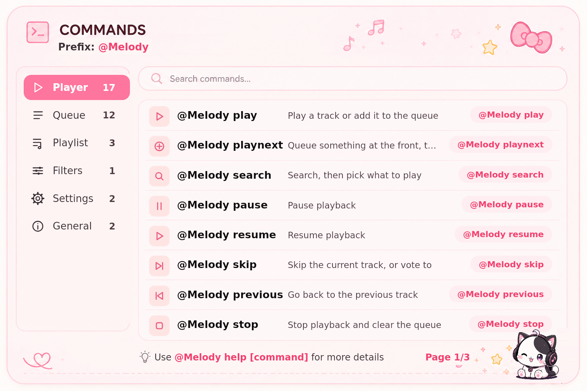 |

One rule (`invocationPrefix`) decides it for the help card, the settings sheet, the playlist card and the router's usage hints, so they cannot disagree. The bot's name is read late, at reply time — the commands are built before the client logs in, so reading it any earlier freezes the fallback into every card.

The card has always taken an `activeCategory`; the handler pinned it to 0, so the sidebar listed six groups and could show one. A button press is dispatched back through the router as a `help` command rather than calling the renderer directly, so it goes through the same permission checks and prefix lookup a typed one does.

The template has room for eight rows, and the sidebar prints each category's real count — so once the player category passed eight commands the card said **16** and showed eight, with the rest reachable from nowhere. Categories now page, with `◀ 2/2 ▶` under the card and a `Page 2/2` marker on it:

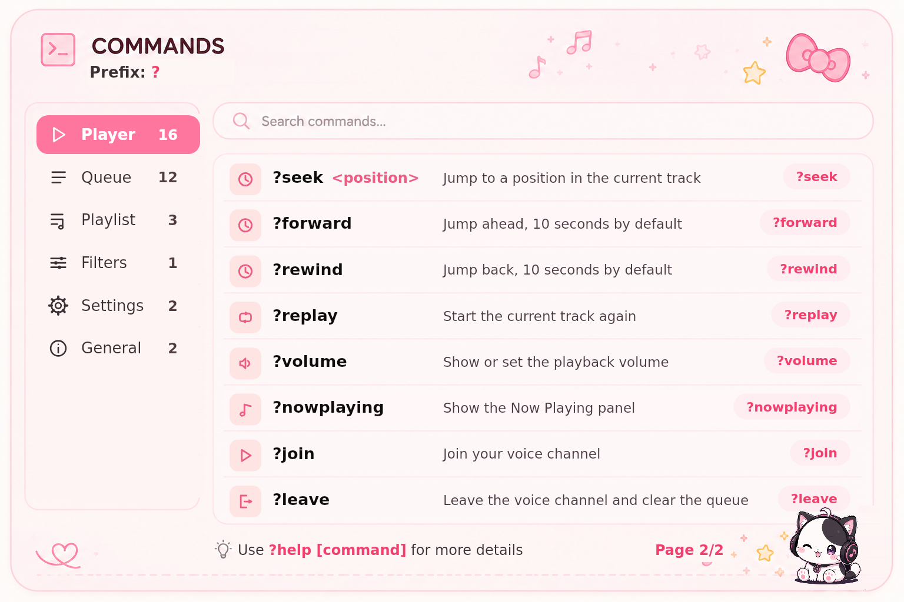

The page rides in the button's id alongside the category (`mb:help:1:2`), because a press hands back nothing else and the card that raised it is a picture. `help player 2` and `/help category:player page:2` reach the same place. A test walks every category and checks that its pages add up to the number the sidebar prints, so the card cannot promise commands no page can show.

Icons come from [Lucide](https://lucide.dev) (ISC), rasterised from their own SVGs at the size each tile draws them, so a 34px row icon and a 46px one are separate renders and neither is soft. `npm run sync:icons` copies the ones the cards use into `assets/icons`, named for the glyph rather than for the Lucide file — the bot reads committed artwork rather than reaching into `node_modules`, the same way it does for fonts and templates.

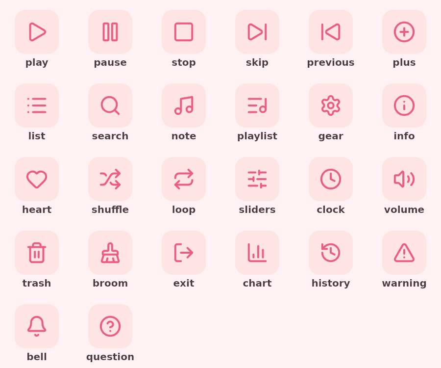

What this file owns is the **mapping**: which command, category or reply tone draws which icon. That is where the bugs were, and they were all found by looking at cards: `remove`, `removemine` and `clear` all drew the rounded square that means **stop**, which says nothing about taking something away; `removedupes` and `leavecleanup` drew it too; `leave` is a departure rather than a stop; `stats` is counts rather than a list; and `history` and the `warning` tone on a refusal each drew a **question mark**, having never been given a glyph at all. A test now walks every command, every alias, and every `icon:` a reply asks for, and fails when one of them would fall through to that question mark — though it cannot catch two rows sharing one icon, which is what `djrole` and `settings` did until the picture showed it.

Two things the picture caught: `<position>` ran straight into the description after it, because the hint was drawn from the end of the name while the description starts at a fixed column — it is clamped now. And `remove`, `move`, `jump` and `removemine` all drew a question mark, having never been given glyphs.

Below, the classic help card:


## Running the bot

You need a Discord application and a Lavalink 4 node. `docker compose` brings up the node for you.

```bash
npm install
cp .env.example .env       # fill in DISCORD_TOKEN and DISCORD_CLIENT_ID

docker compose up -d lavalink   # audio node on 127.0.0.1:2333
npm run dev                     # bot, with reload
```

Or run both in Docker:

```bash
docker compose up -d --build
```

In the [Discord developer portal](https://discord.com/developers/applications) the bot needs:

- the **Message Content** privileged intent — without it only slash commands and `@Bot` mentions arrive
- the **Connect** and **Speak** permissions in the voice channels it should join

Set `DISCORD_DEV_GUILD_ID` while developing: guild commands appear immediately, global ones can take an hour.

### Reviewing the UI without a bot

```bash
npm run preview:canvas    # render every card into preview/
npm test                  # unit tests
npm run typecheck
```

`npm run preview:canvas` needs no Discord token and no Lavalink node — it exists so the UI can be reviewed while iterating on the design.

## Layout

```
src/
├── application/
│   ├── commands/    # command engine: parser, registry, router, cooldowns
│   ├── player/      # per-guild Player and the PlayerManager that serialises it
│   └── services/    # MusicService — what every interface actually calls
├── commands/        # catalog (the shared matrix) and its handlers
├── config/          # environment loading and validation (zod)
├── domain/music/    # Track and Queue — no Discord or Lavalink types
├── resolvers/       # URL parsing, source resolvers, circuit breaker, registry
├── infrastructure/
│   ├── audio/       # AudioBackend seam — the audio engine behind an interface
│   ├── discord/     # client, contexts, buttons, permissions, slash registration
│   └── lavalink/    # Lavalink backend, filter presets, node balancing
├── telemetry/       # JSON logger with secret redaction
└── ui/canvas/       # canvas UI engine
    ├── theme.ts        # color tokens and themes
    ├── fonts.ts        # font registration (bundled → system)
    ├── primitives.ts   # rounded rects, gradients, text truncation/wrapping, durations
    ├── artwork.ts      # artwork loading (host allowlist) + generated placeholder
    ├── glyphs.ts       # line-art command icons drawn from paths
    ├── stickers.ts     # pastel decorations for the code-drawn cards
    └── cards/          # one module per card
scripts/             # dev tooling (canvas preview)
tests/               # unit tests
```

## Autoplay

`autoplay` keeps the music going when the queue runs dry. It had been a switch wired to nothing — the player has always asked for a suggestion at the end of a queue, and until now nobody answered.

There is no recommendation API behind it. It searches for the seed track's artist and takes the best result that is not something the room just heard — a weaker suggestion than a real "related tracks" feed, needing no key, no account and no second provider, which is the trade the lyrics provider makes too.

What it will not hand you:

- the seed itself, anything still queued, or anything in the history
- anything it suggested in this guild's last 40 picks, so it does not circle back
- live streams, and anything over 15 minutes — an hour-long mix is a fine thing to ask for and a poor thing to be given
- the literal words "Unknown artist": a track with no artist falls back to searching its title, since `createTrack` fills a blank field with a placeholder

An autoplayed track is credited to nobody rather than to whoever queued the seed — they did not ask for it. The queue row says so, and the listening stats leave it out: counting it would credit a person who queued nothing and pad the server's totals with whatever played into an empty room.

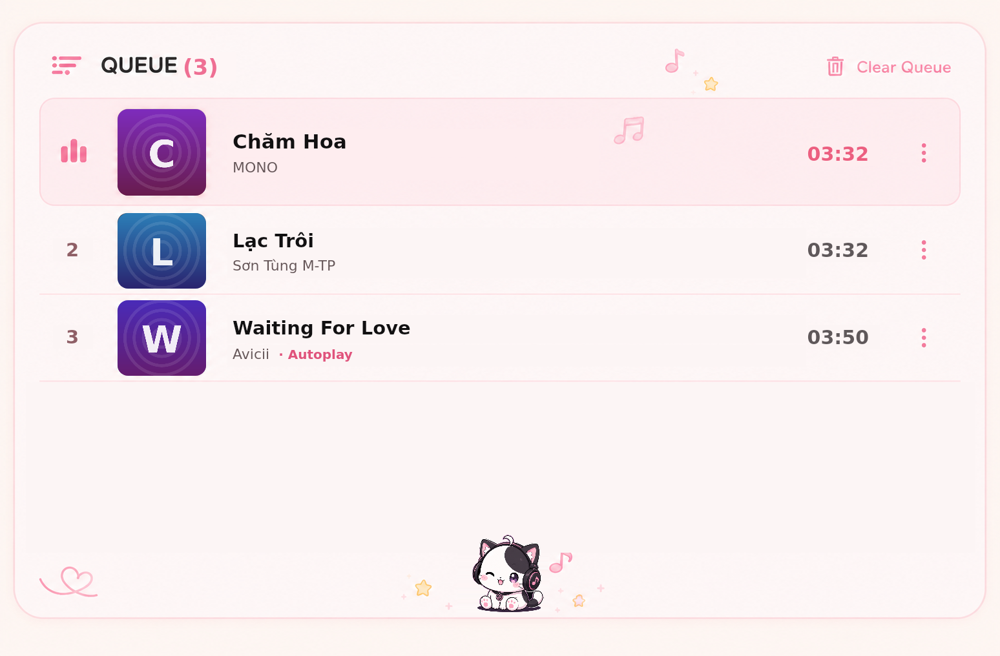

## Editing the queue

| Command            | What it does                                      | Who       |
| ------------------ | ------------------------------------------------- | --------- |
| `remove <n>`       | Takes one track out                               | See below |
| `move <from> <to>` | Moves a track, shifting the rest along            | DJ        |
| `jump <n>`         | Plays that track now, skipping past what is ahead | DJ        |

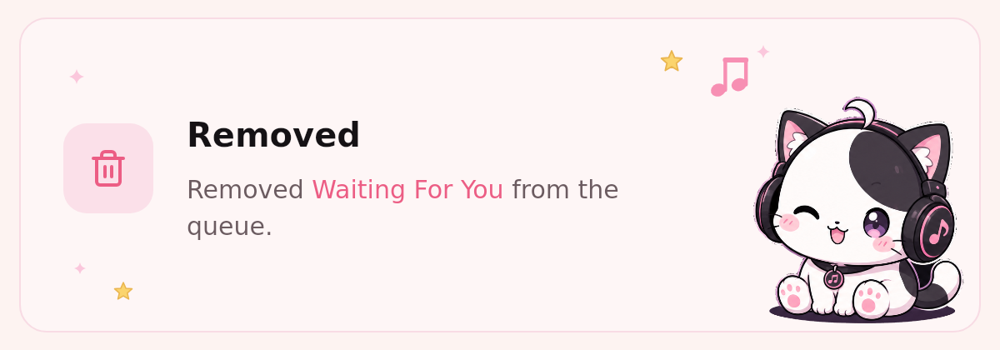

`remove` is the one with a split rule: **anyone may take out a track they queued themselves**, because withdrawing your own request is not a moderation act, while taking out somebody else's is a DJ's call.

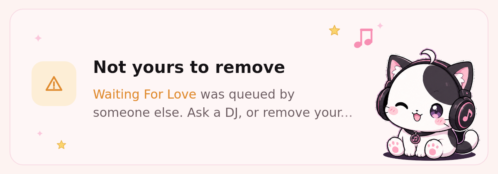

Positions count from 1 and mean the **upcoming** queue — position 1 is the next track up, never the one playing. A position that is not a whole number in range is refused with the range named, and refused before anything moves:

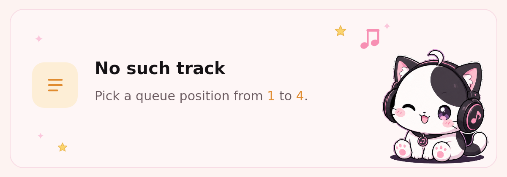

`removemine` takes out only your own tracks and needs no permission: the point is leaving without stranding the room with forty songs nobody else picked, and clearing everyone's is what `clear` is for. `playnext` is the other side of that — jumping the line is a DJ's privilege, so the only difference from `play` is where the track lands. Both were already in the domain (`removeByRequester`, `addNext`) with nothing calling them.

A missing argument reads as `NaN` rather than defaulting to 1, so a mistyped position is refused instead of quietly editing the first track. What `jump` skips over goes into the history rather than being dropped, so `previous` can still reach a track somebody jumped past.

## Spotify, Apple Music and Deezer links

Paste a track, album or playlist link from any of the three and it plays, badged with the service it came from:

| Spotify                             | Apple Music                             | Deezer                             |
| ----------------------------------- | --------------------------------------- | ---------------------------------- |
|  | 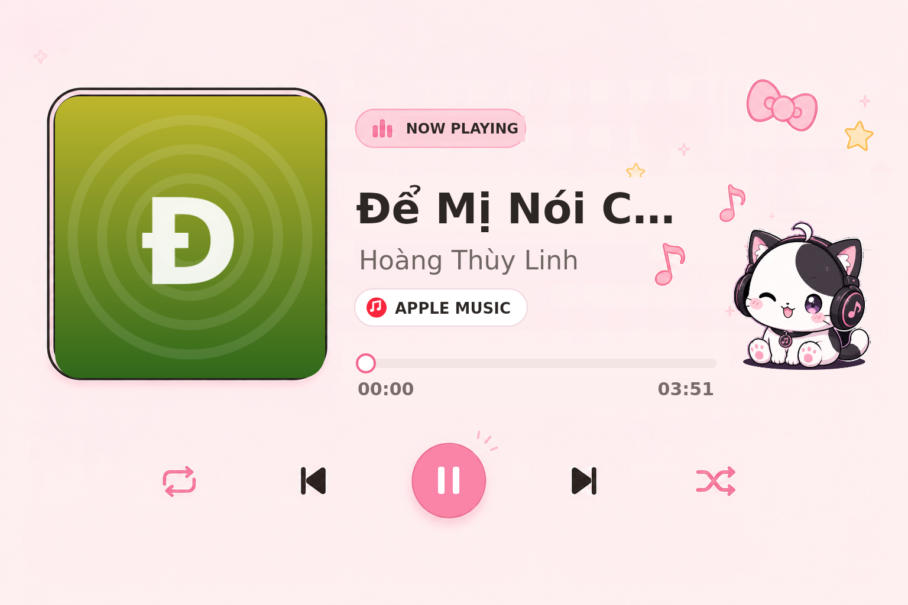 | 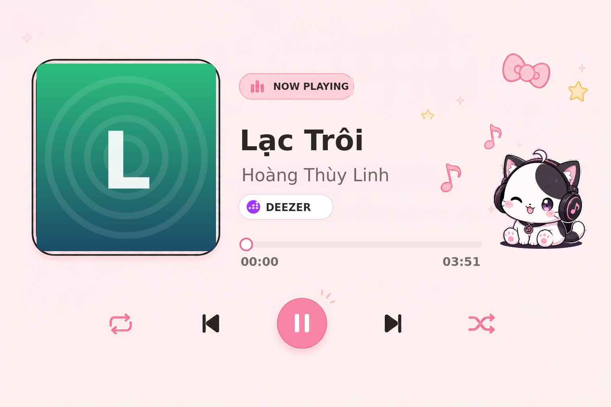 |

The reading is done by the **audio node**, not the bot. Lavalink's LavaSrc plugin already holds each service's credentials and token cache and hands back playable tracks carrying that service's own title, artist and artwork; a second copy of that in the bot would be a second set of credentials and a second thing to keep current. So `LavaSrcResolver` only decides what a link means and passes it on.

Apple Music's links need one piece of care: `/us/album/name/123?i=456` is a **song**, not an album — the page is the album, and `i` says which track on it was shared. Missing that turns one shared song into a whole album queued behind it. Deezer's carry an optional locale (`/fr/track/…`), which is normalised away.

Credentials go to the node, in `docker/lavalink/application.yml`, supplied by compose from `SPOTIFY_CLIENT_ID` / `SPOTIFY_CLIENT_SECRET`, `APPLE_MUSIC_TOKEN` and `DEEZER_DECRYPTION_KEY`. Leave any of them blank and everything else still works — those links come back as unsupported, and the message names the service, because a node is usually set up for one of them and not the others:

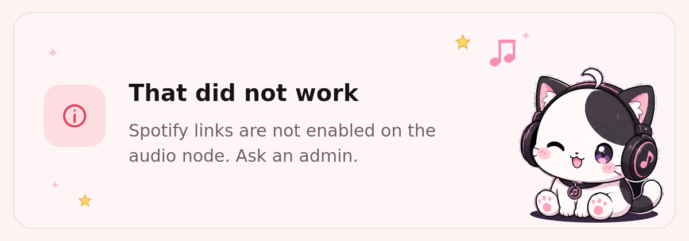

That message matters more than it looks. The load comes back empty whether a track was deleted or the plugin was never installed, and the second is an operator's problem; answering "that track is unavailable" would send whoever reads it looking at the wrong thing. A resolver can now mark a message as already fit for the user, and that one is.

Each service gets its own badge mark and brand colour, from one table both the Now Playing panel and the search card read — two copies drift the moment a source is added, which is exactly what these two would have done. `APPLE MUSIC` is spelled the way Apple spells it rather than as the `applemusic` the code calls it.

## What already played

`history` (also `played`, `recent`) shows what the room has been through, newest first:

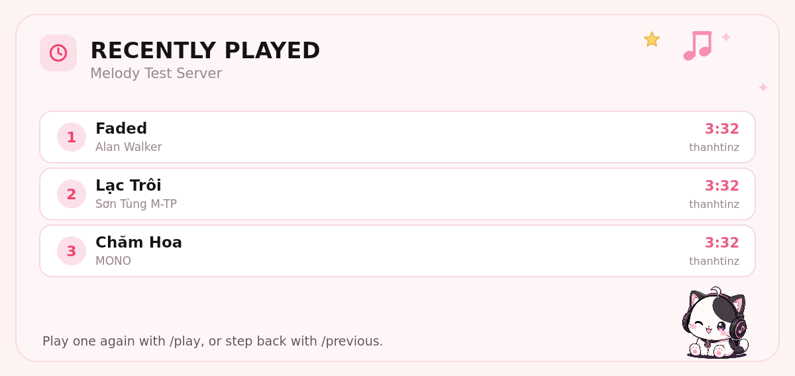

Row 1 is what just finished, because that is what somebody asking "what was that song" means — the domain keeps the list oldest-first for `previous` to walk back through, and the card reverses it. It shows who queued each track, so an autoplayed one reads as **Autoplay** rather than as somebody's request.

The card is as tall as the history is long. A fixed height left a room that had played two songs staring at four empty rows, and the first attempt at shrinking it put the mascot on top of the last row's duration — there is a band under the final row now that the footer and the mascot share.

## Search, then pick

`play` takes the first result, which is right when you know what you want and wrong when the first hit is a cover, an hour-long mix, or the wrong language. `search` (also `find`, `sr`) shows what was found and lets the asker choose:

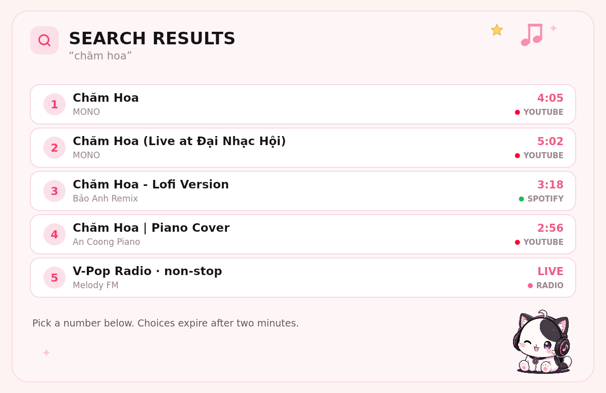

Five results, because that is what fits on one row of Discord buttons — a row on the card that no button can pick would be a lie about what is on offer, so the card draws five whatever came back. Pressing a number queues that track through exactly the same path as `play`: same connect, same guild lock, same Now Playing panel.

A pending choice belongs to one person in one guild, so two people searching at once do not pick from each other's lists, and pressing a number on somebody else's card queues nothing. Choices expire after two minutes, and a used one is spent — one search queues one track. Everything that can go wrong (the wrong person, a stale card, a number off the end, not being in a voice channel) is answered privately, so a mis-press does not put a notice in front of the channel; a number off the end or a missing voice channel keeps the list, because losing a whole search to a typo is the harsher answer.

One thing to know about the failure case: the resolver registry catches a provider's own failure and drops its results so one dead source cannot empty the whole list, which leaves nothing here to tell an outage apart from a query that matches nothing. Both read as **No results**.

## Cards are sent as WebP

Encoding is the whole cost of a card. Compositing the template and drawing the live state takes ~0 ms; encoding the 1536×1024 result is what takes the time:

| Encoding                             | Time    | Size      |
| ------------------------------------ | ------- | --------- |
| PNG                                  | ~660 ms | 947 KB    |
| WebP q90 (default)                   | ~140 ms | **56 KB** |
| WebP q100 (lossless in this encoder) | ~380 ms | 826 KB    |

The same region of the same card, zoomed 3× — PNG on top, WebP q90 below:

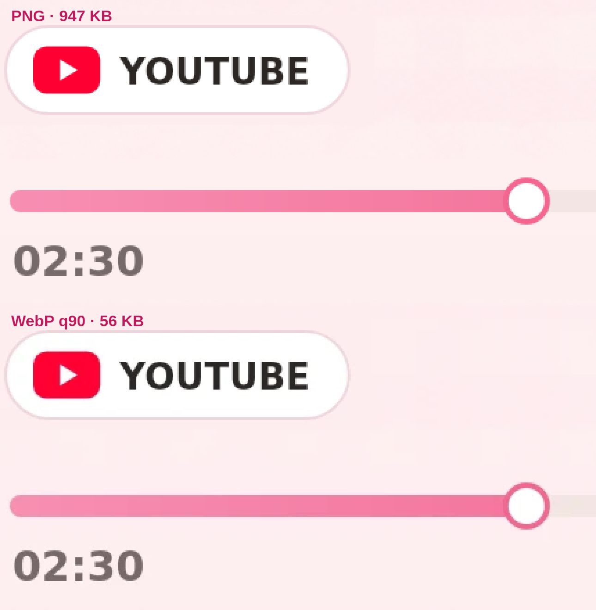

Quality 90 rather than the 70 that also looks fine: the difference is 26 KB against a 947 KB baseline, which is not worth saving on a card somebody might zoom into. Compared side by side at 2× zoom — title, Vietnamese diacritics, the source badge, the timestamps — q90 and the PNG are the same picture. Lossless WebP saves only 13% over PNG and takes three times as long, so it earns nothing.

`CARD_FORMAT=png` puts it back if a client ever refuses WebP, and attachment names follow the format (`now-playing.webp`), because Discord reads the extension to decide whether a file is an image worth showing inline. The committed preview images stay PNG so GitHub can draw them.

## A progress bar that moves

The card is a PNG, so the bar drawn inside it is frozen at the moment it was rendered. The live bar is the line of text above it:

```
▬▬▬▬▬▬▬▬🔘▬▬▬▬▬▬▬▬▬ `2:00 / 4:05`
[ the Now Playing card ]
```

Every five seconds the ticker rewrites **only the message text**. Editing text leaves the attachment alone — discord.js omits `attachments` when no files are passed, and Discord keeps what it already has — so the image is neither re-uploaded nor re-fetched, and the panel does not blink.

The alternative was redrawing the card each tick, and the measurements ruled it out. Encoding is the whole cost of a card: compositing the template takes ~0 ms, encoding the 1536×1024 PNG takes ~660 ms and produces 947 KB. A four-minute song at a five-second cadence is 48 renders — **45 MB and 32 seconds of CPU per song per guild**, before a second guild plays anything. The text line costs one edit of a couple of hundred bytes and no encoding at all.

Details that matter more than they look:

- The knob replaces a block rather than sitting between two, so the bar is the same width at 0:00 and at 4:05 and the line never reflows under the card.
- A paused player's line says `· paused`, then stops changing — a bar that quietly stopped moving looks identical to one that broke.
- A live stream gets `🔘 **LIVE**` and no ticker at all: there is no position to follow.
- An unchanged line is not sent. `setContent` returning `false` — a deleted panel, or an interaction token past its fifteen minutes — stops the ticker rather than retrying.
- One panel per guild. A second `nowplaying` adopts the new panel and drops the old one, so two tickers never spend two requests saying the same thing.

## Stepping through a track

`seek` needs a position; `forward`, `rewind` and `replay` need nothing at all. Missing a line is the common case, so `forward` and `rewind` move ten seconds unless told otherwise (`forward 30`, `rewind 1:00`), and `replay` goes back to the top.

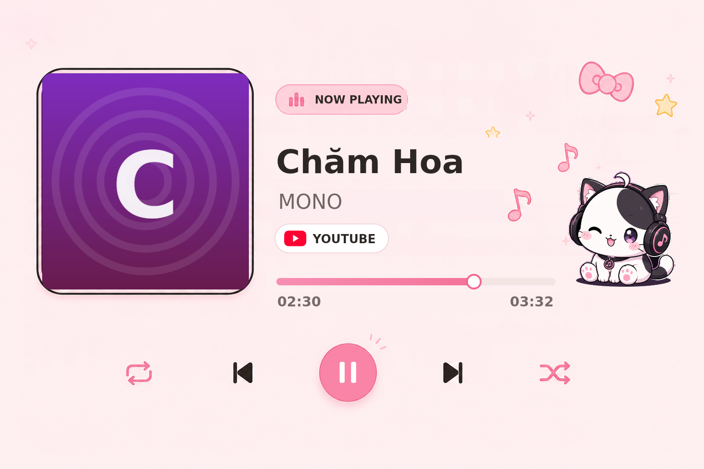

Each one redraws the panel, because the panel is the answer — the progress bar is where the jump landed. The distance is relative on purpose: somebody who wants the last ten seconds again should not have to read the clock, do the subtraction and type the result. Jumping past either end lands on that end rather than off it.

A live stream has no position to jump to. The player quietly ignores the attempt, so all three say so instead of redrawing an unchanged panel:

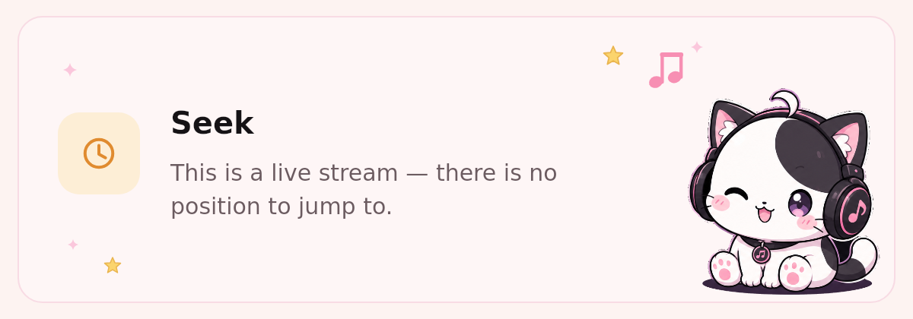

## Announcing each track

A track that starts on its own — the next in the queue, or an autoplay pick — has no command waiting on it, so until now a room only ever saw the song it had asked for. Each one now posts its own panel, with the same controls and the same moving progress line:


The ticker adopts the new panel, because that is the one on screen. Guilds that would rather have a quiet channel turn it off with `settings announce off`; it is on by default, since a room that cannot see what is playing has to ask.

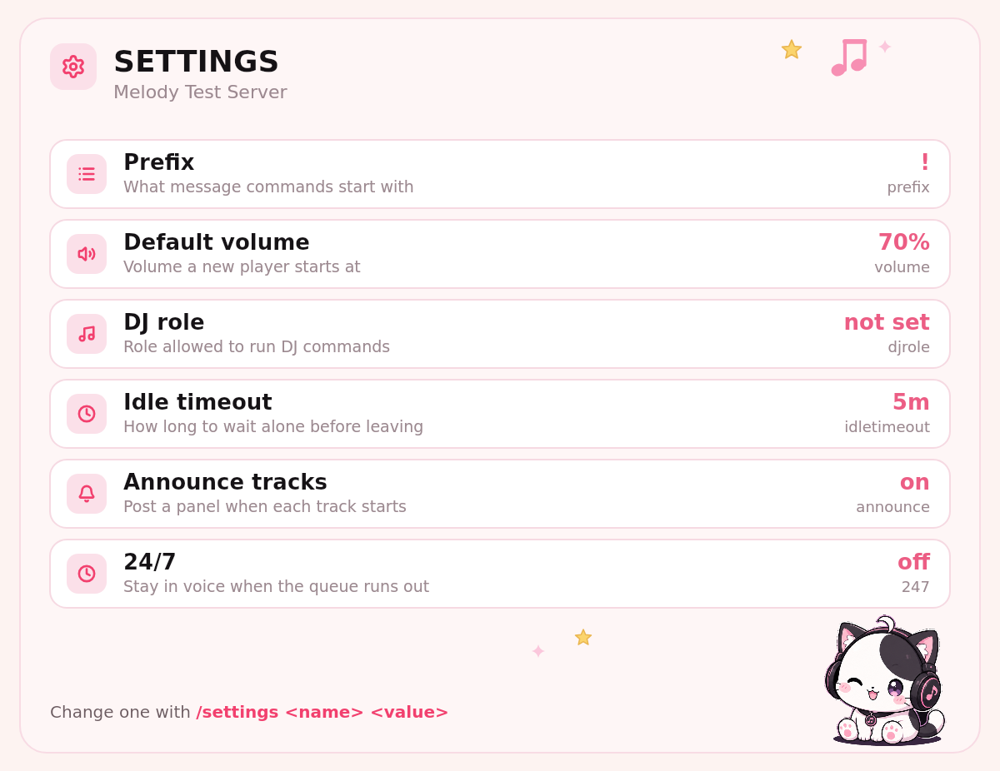

Two things that picture caught. The sheet was fixed at five rows, so adding this setting pushed **24/7** off the bottom and said nothing about it — the card is drawn in code, so it grows with the list now, and a test compares a card built without its last row to prove the renderer is not stopping early. And the new row drew a **question mark**: `announce` had no glyph. It gets a bell. On the same card, `djrole` was drawing the same gear as **Settings** itself — two rows, one icon, neither of them saying anything — so the role that runs the music gets a note.

## Saving what is playing

`grab` (also `save`, `yoink`) sends the current track to your own messages — the Now Playing card so the song is recognisable at a glance in a DM full of them, and the link as text, because a link drawn into an image is a link nobody can follow.

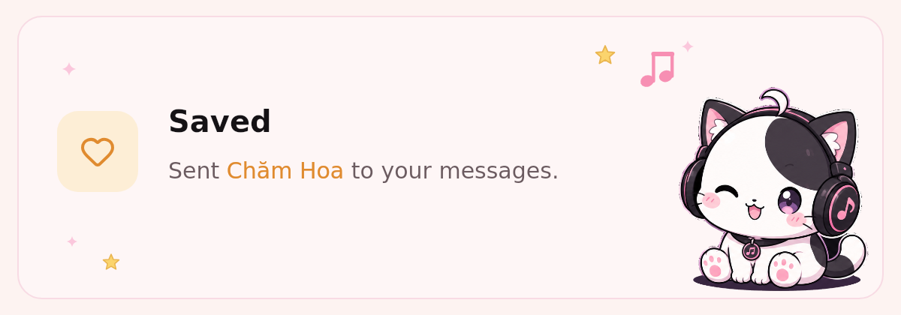

Both replies are private: a room does not need to watch somebody save a song. Closed DMs are the ordinary case rather than an error — plenty of people have messages from server members turned off — so the send comes back as a `false` the command explains, instead of an exception thrown at the reply:

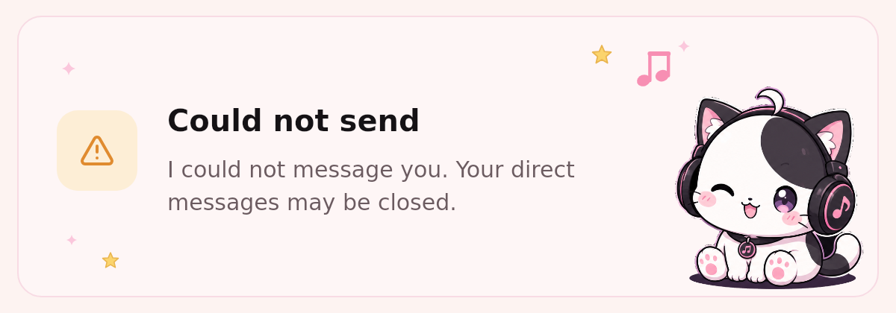

Sending the message is a port (`directMessage`), so the service stays free of discord.js and a test can watch what would have been sent.

## Cleaning up a queue

Two commands for a queue that has drifted from what the room wants:

| Command        | What it drops                                            |
| -------------- | -------------------------------------------------------- |
| `removedupes`  | Repeats, keeping the earliest copy of each               |
| `leavecleanup` | Tracks queued by people who have left the channel        |
| `removemine`   | Everything you queued — yours only, no permission needed |

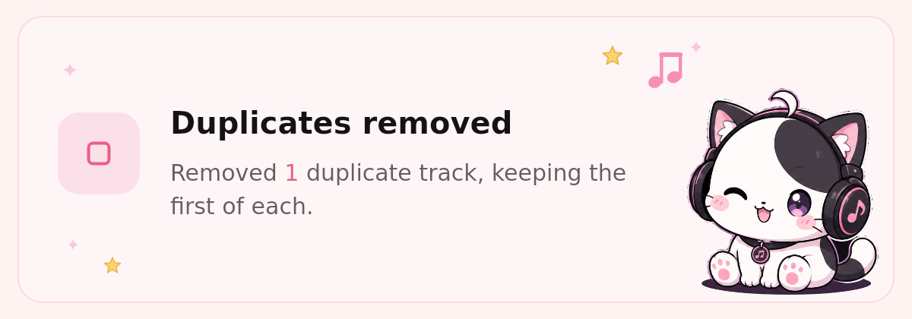

`removedupes` matches a track by source and identifier rather than by queue entry: the same song added twice is two entries with two ids, so matching by entry would find nothing. What is playing counts as already queued, because a long playlist looping back onto the current track is the usual way a queue fills with repeats.

`leavecleanup` needs the voice channel to be readable, and refuses when it is not — an unknown room and an empty one mean very different things, and guessing would throw away the queue of everybody present. It never withdraws the track already playing: that one is already sounding in the channel.

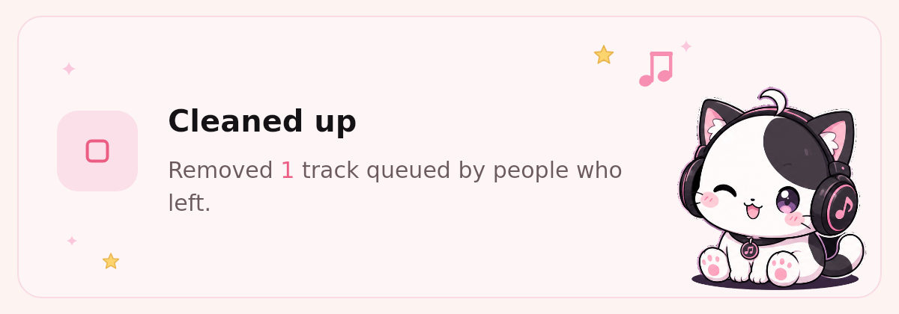

One reader answers "who is listening" for both the skip vote and the cleanup, so the two cannot disagree about who is in the room.

## Voting to skip

`skip` (also `voteskip`, `vs`) is open to everyone now, and gated by a vote:

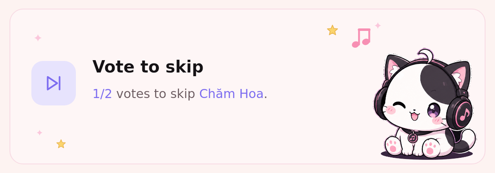

Three ways it skips without a vote — a DJ asked, whoever queued the track asked (it is theirs to withdraw), or nobody else is listening. Otherwise it takes a simple majority of the room.

The tally is counted against the room **as it is now**, not as it was when the vote opened: three listeners becoming one should not leave a vote stuck needing two. A vote belongs to the track it was opened on, so the next song starts over — carrying it forward would let people skip a track they never heard. Voting twice does not count twice.

If the listener count cannot be read, the vote falls back to asking one person. Refusing to skip on missing information would be worse than skipping too easily.

## Lyrics

`lyrics` looks up the current track, or whatever you name. Long songs page with buttons:

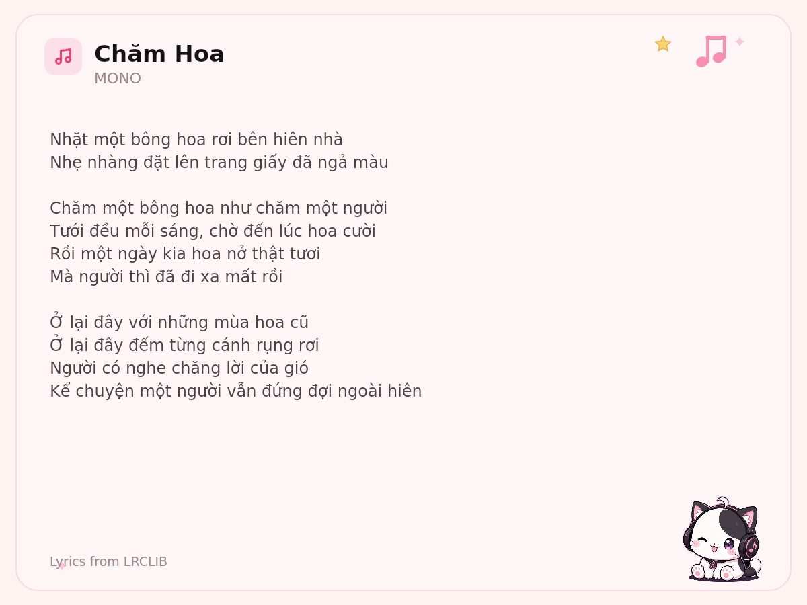

Words come from [LRCLIB](https://lrclib.net), chosen because it needs no key and no account — running this bot stays a matter of a token and a Lavalink node. The provider is behind a port, so a second source is a new implementation rather than a change to the command.

It gets the same treatment as the track resolvers: a 6-second timeout and a circuit breaker, because a lyrics service having a bad day must not hold a command open until Discord expires the interaction. Video-title decorations (`(Official MV)`, `[Lyrics]`, `| Official Audio`) are stripped before searching, and only the primary artist is sent — the difference between a hit and nothing at all.

The lookup is remembered per guild so a page button turns the page instead of spending another request.

## More than one audio node

`LAVALINK_NODES` takes extra nodes as `name@host:port:password` (comma separated, `:secure` for TLS). The single-node variables stay the first node, so an existing deployment keeps working untouched. An entry that will not parse is skipped with a warning — one typo in a list of three should cost that node, not the whole bot — and a repeated name _or_ address is dropped, because either would have Shoukaku connect to the same node twice.

When a node goes away, the guilds that were on it are named in a `nodeLost` event and each one is re-established on another node: the track starts again from the position it had reached, keeping the queue, the history and a pause. A node dying costs seconds rather than the session.

The failover runs under the same per-guild lock as everything else, so a command arriving mid-failover cannot interleave with the reconnect, and a reconnect that fails is reported rather than thrown at the event loop.

## Health and metrics

Set `METRICS_PORT` and the bot serves three endpoints (on loopback by default, so it is not exposed by accident):

| Path       | Answers                                                     |
| ---------- | ----------------------------------------------------------- |
| `/healthz` | Is the process alive?                                       |
| `/readyz`  | Can it actually play — gateway up, at least one audio node? |
| `/metrics` | Prometheus text format                                      |

Liveness and readiness are separate on purpose: an orchestrator restarting the container on a failed liveness check must not do so merely because Lavalink is down, which is what readiness reports. `/readyz` names the failing check in its body rather than just saying no.

Metrics cover commands (by name and outcome, with a duration histogram), active players, guilds, gateway latency, and each audio node's state and player count. Gauges are refreshed at scrape time, so a scrape never reports whatever happened to be true when the last command ran.

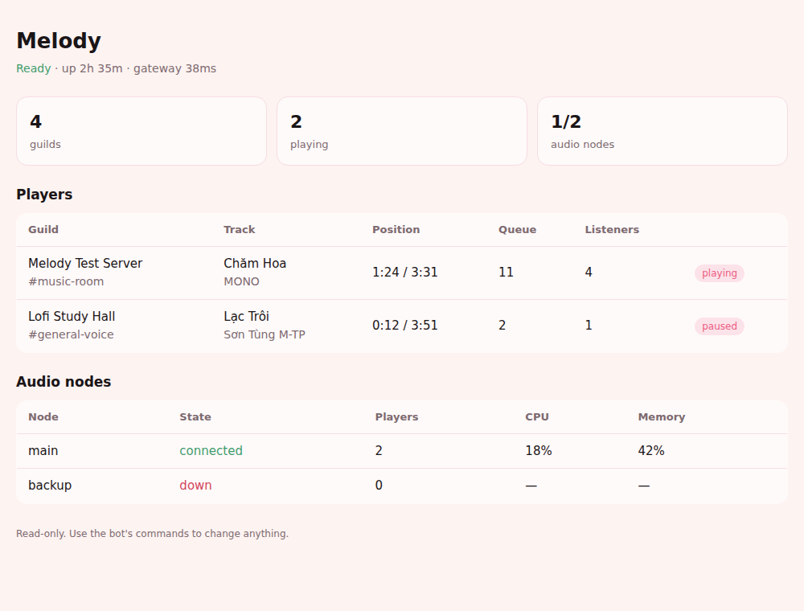

The page is **read-only on purpose**. Controls would need authentication, and an unauthenticated page that can stop playback in every guild is worse than no page at all — it says what the bot is doing, and the commands stay the way to change it. Everything written by other people (guild names, channel names, track titles) is escaped, so a server called `<script>` does not become one.

The registry is hand-rolled — the bot needs four metric shapes and the text format is a dozen lines to emit, so a dependency here would be more code to keep current than the thing it replaces.

## Surviving a restart

A deploy in the middle of a set should cost the listeners a few seconds, not their queue. Each guild's session — voice channel, queue, history, loop, autoplay, filter, and where the current track had got to — is written to `SESSION_STORE_PATH` and picked back up when the bot returns.

Writes are debounced: filling a queue fires an event per track, and saving each one would turn one command into a hundred file writes for a state that is stale a millisecond later. On shutdown every player is flushed **before** the players are torn down — destroying them first would save the state of a queue that has already been cleared.

Coming back:

- playback resumes at the saved position rather than from the top, and comes back paused if it was paused
- each guild is restored independently, so one guild whose voice channel has since been deleted does not stop the others
- a session is cleared whether or not it restored, because one that failed now will not restore any better next time
- sessions older than `SESSION_MAX_AGE_MS` (15 minutes by default) are dropped. Coming back after a short deploy is a courtesy; coming back after a day and playing into a room that emptied hours ago is a nuisance

## Guild settings

`settings` with no arguments renders the sheet; with a name and value it changes one:


| Key           | What it does                          |
| ------------- | ------------------------------------- |
| `prefix`      | What message commands start with      |
| `volume`      | Volume a new player starts at         |
| `djrole`      | Role allowed to run DJ commands       |
| `idletimeout` | How long to wait alone before leaving |
| `247`         | Stay in voice when the queue runs out |

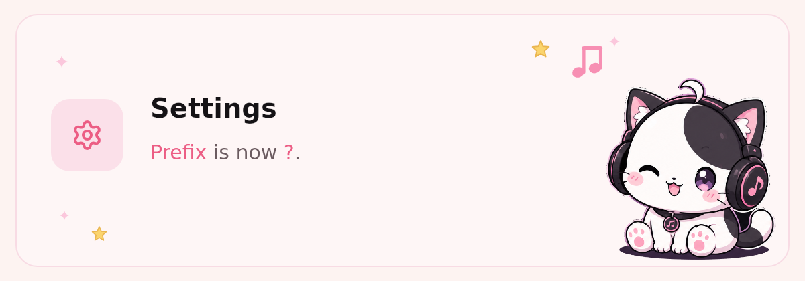

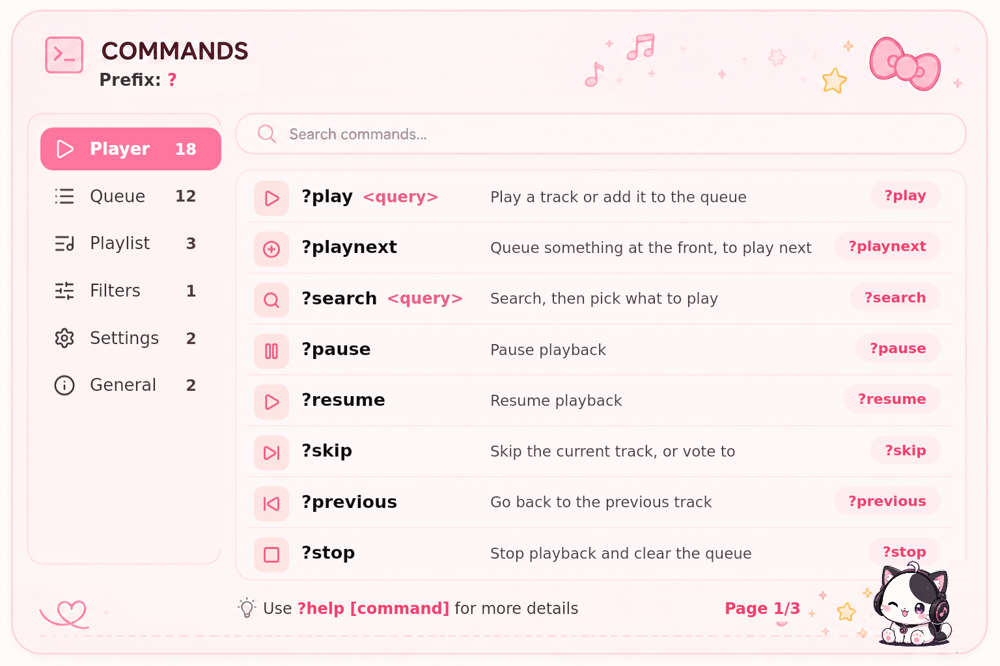

`volume` is the third setting that was written and never read: a new player took the environment's volume whatever the guild had configured. Every path that can create a player now goes through one place that asks for the guild's, so it cannot apply on `play` and not on `join`. It is what a player _starts_ at — changing it does not reach into a session already running, which is what the `volume` command is for.

Each guild's prefix is read **before its messages are parsed**, so `settings prefix ?` actually changes what the bot answers to — as does its DJ role, which is applied wherever a tier is decided (message, slash command, button). Both were configurable and then ignored until now: the handler parsed with the environment's prefix and judged tiers by the environment's role, which made those two settings switches wired to nothing. The help and playlist cards print the guild's prefix too — a hint telling people to type `!play` on a server using `?` is wrong twice. A settings read that fails falls back to the environment's values rather than dropping the command.

Settings are declared once, as data (`SETTING_DESCRIPTORS`), and the command, the card and the validation all read from that list — a setting cannot be half-added. Reading a guild's settings fills in the environment defaults without writing them back, so a guild nobody has configured behaves like one set to the defaults rather than one with holes in it.

Storage is the same port-and-JSON-file arrangement the playlists use; both now share one `JsonStore` with the atomic-rename write, rather than two near-identical copies.

## Listening stats

`stats` (also `activity` or `top`) answers about **you**: your own top tracks and artists, how much of the server's listening is yours, and where you come among its listeners — with your row picked out of the list.

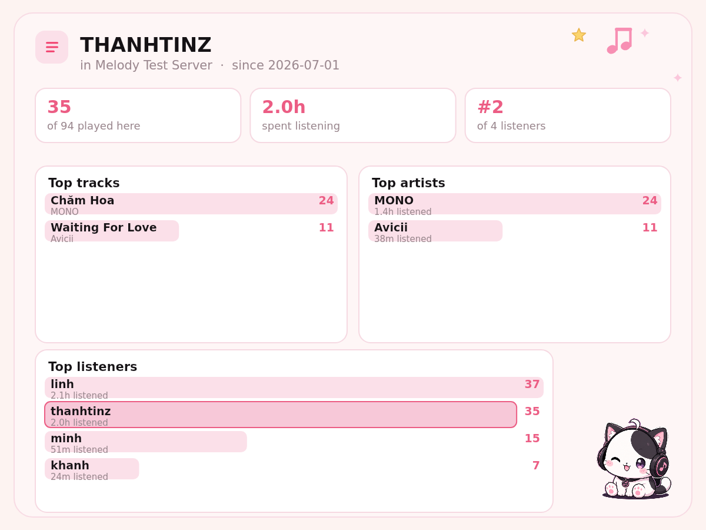

| Command          | Who it reports on |
| ---------------- | ----------------- |
| `stats`          | You               |
| `stats @someone` | That person       |
| `stats server`   | The whole server  |

Your own numbers are what you usually want, so they are what a bare `stats` gives; the server is a word away. `guild`, `all` and `everyone` are taken the same as `server`, because those are the words people reach for.

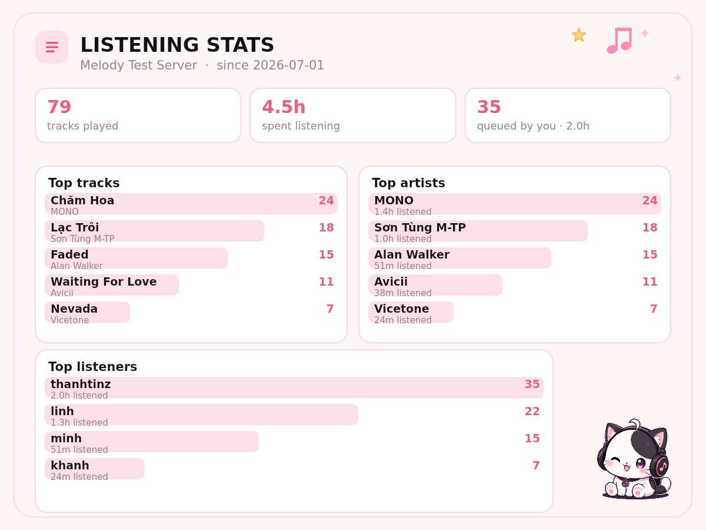

The per-person view needs per-user track counts, so each person's own list is kept alongside the guild's, capped tighter at 50 tracks each: three hundred songs across three hundred people is a file nobody wants, and the guild list is the one that keeps the long tail. A record written before per-user tracks existed starts collecting them rather than failing to load.

A play is counted when a track **ends**, not when it starts, and with the time it was up for — queueing forty songs and skipping thirty-nine of them should not read as forty songs listened to. The measure is wall time between start and end, capped at the track's own length; that counts a pause as listening, which overstates a little, and the cap is what stops it overstating a lot. A live stream has no length to cap against, so wall time is all there is.

What is kept is aggregated rather than a log of every play: a busy server would otherwise grow an unbounded file, and nothing here asks "what happened at 14:32" — only "what gets played". Tracks are keyed by `source:identifier`, so the same song found through two different searches counts once, and the newest title wins over whatever it was first called. Per guild, the 300 most-played tracks and people are kept and the rest pruned, dropping the least-played first.

The card falls back to _Someone_ for a person whose display name is not cached: a raw snowflake is unreadable, and it is somebody's account id — neither belongs in a picture posted to a channel. A guild with nothing played yet gets a sentence rather than an empty chart, which just looks broken.

Counts live in `STATS_STORE_PATH`, on the same `JsonStore` as playlists, settings and sessions. Blank it and the numbers are kept in memory and start over on every restart.

## Seeing what the bot replies

```bash
npm run preview:replies
```

Runs the real services through the real reply decorator with a fake audio backend, in the same card variant the bot defaults to, and writes each answer to `preview/reply-*.png`. Because the cards come from the command path rather than from hand-written sample data, a preview cannot drift from what a user would see — and mistakes show up as pictures.

It has already earned its place. Rendering the `stats` replies turned up a notice card that dropped everything past two lines with no sign it had — a sentence that stops mid-word reads as a broken bot, so an overlong message now ends in an ellipsis. Two more bugs were invisible in the source and obvious the moment the cards were rendered: `<#id>` and `` `play` `` are Discord chat markup, so on an image they were drawn literally as `<#voice-a>` and `` `play` ``. Channels are now named (`#general-voice`, falling back to _the voice channel_ when the name is not cached) and inline code is drawn in the accent colour like bold.

## Joining and leaving

| Command | Aliases             | What it does                                              |
| ------- | ------------------- | --------------------------------------------------------- |
| `join`  | `summon`, `connect` | Joins your voice channel without queueing anything        |
| `leave` | `disconnect`, `dc`  | Leaves and clears the queue, saying how much went with it |

`join` is also how the bot is moved. `play` never moves it — an existing session keeps its channel, because moving should be something someone asked for rather than a side effect of a person in another channel running a command.

A move is a real reconnect, not a field change: Lavalink destroys its player when the bot leaves a channel, so the current track is started again from the position it had reached, and stays paused if it was paused.

## Every reply is a card

Commands that used to answer with a line of chat answer with a panel in the same pastel style, so a reply looks like it came from the same place as the Now Playing and queue cards:

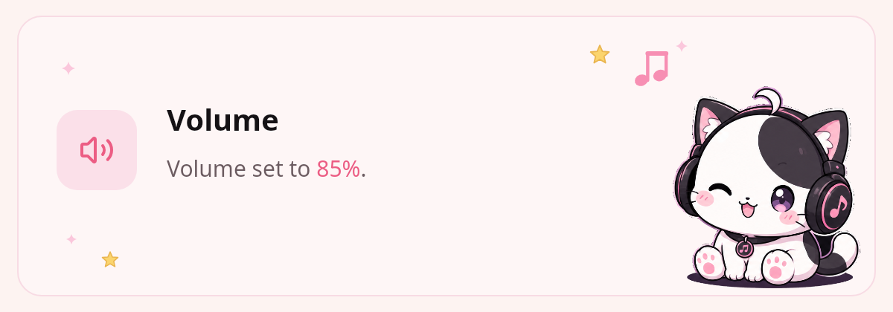

Four tones — success, info, warning, error — change the accent and the icon, never the layout: a warning that redesigned the card would stop looking like the same bot.

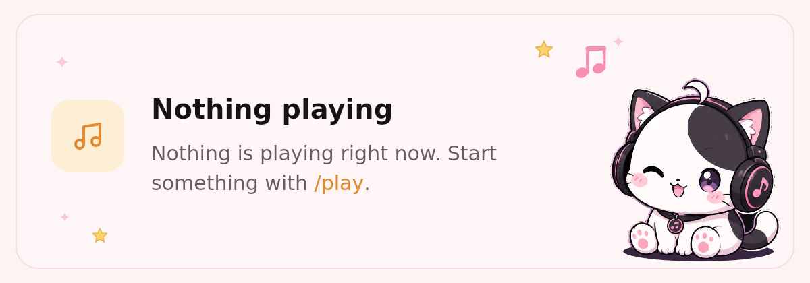

The conversion happens once, in `withNoticeCards`, which wraps the command context rather than sitting at each call site. A command still writes its reply as a sentence and adds a `title`/`icon`/`tone` if it has an opinion; anything already carrying a panel is left alone, and if a card fails to render the original text goes out instead — losing the picture is survivable, losing what the bot was saying is not.

`**bold**` runs in a message are drawn in the accent colour, so the messages keep working as chat text too.

## Saved playlists

`playlist` works over slash, prefix and the library card's page buttons:

| Action                            | What it does                                         |
| --------------------------------- | ---------------------------------------------------- |
| `playlist list`                   | Renders your library as a card, paged by its buttons |
| `playlist create <name>`          | Creates an empty playlist                            |
| `playlist add <name>`             | Adds the current track, creating the playlist if new |
| `playlist play <name>`            | Queues every track in it                             |
| `playlist remove <name> <n>`      | Removes track `n`, counting from 1                   |
| `playlist delete <name>`          | Deletes the playlist                                 |
| `playlist public\|private <name>` | Changes who can see it                               |

`favorite` (or the heart on the Now Playing panel) toggles the current track in a playlist called **Favorites** — pressing it again takes the song back out. Favorites are a playlist rather than a second store, so they show up in the library and behave like any other one, and there is only one implementation to keep right. A song is matched by source and identifier, not by queue entry, so favoriting the same track twice cannot leave two copies.

Names are matched case- and whitespace-insensitively, so `chill vibes` finds `Chill  Vibes`. Limits are 25 playlists per person per guild and 500 tracks each.

A playlist stores what it takes to rebuild a track, not the track object — the per-enqueue id and the original requester do not survive being saved, so a replayed track is attributed to whoever played it.

Storage is behind a port (`PlaylistRepository`), so it can move to PostgreSQL in F8 without the command layer changing. Until then `PLAYLIST_STORE_PATH` writes a JSON file — whole-file writes, moved into place with a rename, so a crash cannot leave half a library. Blank the variable to keep playlists in memory instead and lose them on restart.

## Customising the look

- **Fonts:** drop a `.ttf`/`.otf` into `assets/fonts/` — no code change needed.
- **Colors:** add a theme in `src/ui/canvas/theme.ts`.
- **Artwork:** only fetched from the host allowlist in `src/ui/canvas/artwork.ts` (SSRF guard). Unknown hosts and failed downloads fall back to a gradient cover generated from the track name.

## Roadmap

| Phase | Scope                                                                    | Status  |
| ----- | ------------------------------------------------------------------------ | ------- |
| F1    | Project skeleton, config, logger, **canvas UI + Now Playing card**       | ✅ done |
| F2    | Domain: track and queue (loop, shuffle, history, snapshots) + queue card | ✅ done |
| F3    | Unified command engine (slash + prefix + @mention) + help card           | ✅ done |
| F4    | Player, player manager, audio-backend seam, node balancing               | ✅ done |
| F5    | Resolvers: URL parsing, YouTube / Spotify metadata / radio, breaker      | ✅ done |
| F6    | **Discord + Lavalink wiring**: live commands, buttons, filters, Docker   | ✅ done |
| F7    | **Saved playlists**, **favorites**; lyrics, vote-skip                    | 🚧      |
| F8    | **24/7, state recovery**; PostgreSQL + Redis                             | 🚧      |
| F9    | **Metrics and health**; Lavalink cluster, failover, dashboard            | 🚧      |

## License

MIT © thanhtinz
