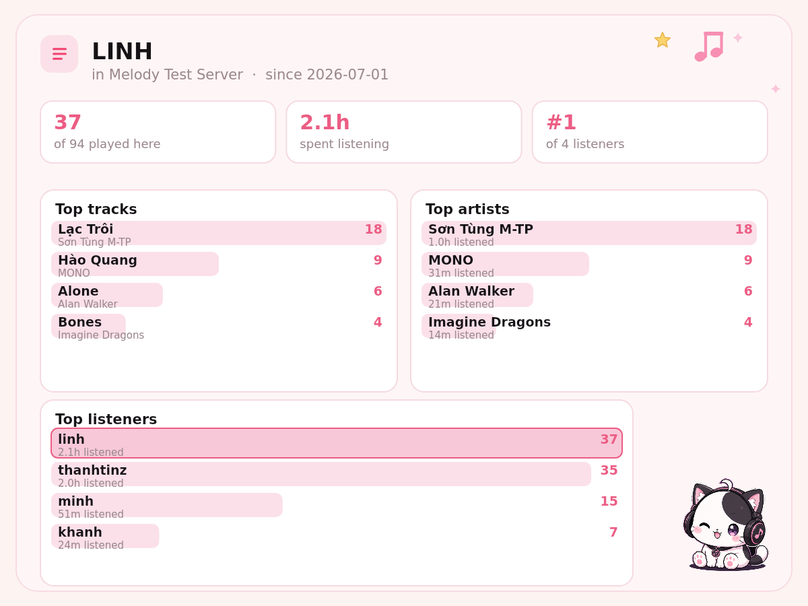

# Music Bot

A production-grade Discord music bot — TypeScript + discord.js + Lavalink 4 — with a **Canvas UI** that renders the Now Playing / Queue panels as images instead of plain text embeds.

> Status: built phase by phase. See the [Roadmap](#roadmap).

## Two card styles

The `sakura` variant composites live player state onto an illustrated pastel template — only the cover, title, artist, source badge, progress, timestamps and the transport glyph are repainted, so the artwork keeps its hand-made look:

| Playing                             | Paused                                     |
| ----------------------------------- | ------------------------------------------ |
|  |  |

The queue has a template too. Its five rows are filled from the live queue — cover art, titles, real positions, and durations — and any rows the page does not fill are cleared:


Long queues page through it. The current track keeps the highlighted first row on every page and the other four rows advance, so a button handler re-renders the image for the new page:

```ts
const slice = paginateSakuraQueue(queue.tracks, page); // 4 upcoming per page
await renderQueueCard({
  current,
  tracks: slice.items.map((track, i) => ({ position: slice.firstPosition + i + 1, ...track })),
  page: slice.page,
  totalPages: slice.totalPages,
  variant: 'sakura',
});
```


The command list too. Its sidebar, highlight, rows and every icon come from the catalog — the icons are drawn, not taken from the artwork, so `/shuffle` never inherits a pause symbol:


The playlist library is drawn entirely in code — no template behind it — with its own pastel stickers, so it sits alongside the template-backed cards without one:


```ts
await renderNowPlayingCard({ ...playerState, variant: 'sakura' });
await renderQueueCard({ ...queueState, variant: 'sakura' });
await renderSakuraHelpCard({ categories, activeCategory, commands, prefix });
await renderSakuraPlaylistCard({ entries, ownerName, page, totalPages, prefix });
```

Swapping either template means re-measuring the region coordinates in `src/ui/canvas/cards/now-playing-sakura.card.ts` and `queue-sakura.card.ts`; they are pixel measurements of those specific images. Note the two queue variants page differently — the classic list fits 10 rows, the illustrated one 5.

## The classic variant: a canvas-rendered UI

Every panel the user sees is rendered server-side with [`@napi-rs/canvas`](https://github.com/Brooooooklyn/canvas) and sent to Discord as a PNG:

- Rounded cover art over an ambient background blurred from that same artwork
- A deterministic waveform per track — the same track always renders the same silhouette
- Gradient progress bar, source badge, and a state bar (requester / volume / loop / queue / filter)
- Three themes: `midnight`, `sunset`, `forest`
- Full Unicode text support, including Vietnamese diacritics

| Playing                              | Paused                              | Radio / live stream                |
| ------------------------------------ | ----------------------------------- | ---------------------------------- |
|  |  |  |

The queue is rendered the same way — a paginated list card that grows with the page:


Cards render straight from a live `player.snapshot()`, so what you see is real player state:


Help is generated straight from the command catalog:


## Running the bot

You need a Discord application and a Lavalink 4 node. `docker compose` brings up the node for you.

```bash
npm install
cp .env.example .env       # fill in DISCORD_TOKEN and DISCORD_CLIENT_ID

docker compose up -d lavalink   # audio node on 127.0.0.1:2333
npm run dev                     # bot, with reload
```

Or run both in Docker:

```bash
docker compose up -d --build
```

In the [Discord developer portal](https://discord.com/developers/applications) the bot needs:

- the **Message Content** privileged intent — without it only slash commands and `@Bot` mentions arrive
- the **Connect** and **Speak** permissions in the voice channels it should join

Set `DISCORD_DEV_GUILD_ID` while developing: guild commands appear immediately, global ones can take an hour.

### Reviewing the UI without a bot

```bash
npm run preview:canvas    # render every card into preview/
npm test                  # unit tests
npm run typecheck
```

`npm run preview:canvas` needs no Discord token and no Lavalink node — it exists so the UI can be reviewed while iterating on the design.

## Layout

```
src/
├── application/
│   ├── commands/    # command engine: parser, registry, router, cooldowns
│   ├── player/      # per-guild Player and the PlayerManager that serialises it
│   └── services/    # MusicService — what every interface actually calls
├── commands/        # catalog (the shared matrix) and its handlers
├── config/          # environment loading and validation (zod)
├── domain/music/    # Track and Queue — no Discord or Lavalink types
├── resolvers/       # URL parsing, source resolvers, circuit breaker, registry
├── infrastructure/
│   ├── audio/       # AudioBackend seam — the audio engine behind an interface
│   ├── discord/     # client, contexts, buttons, permissions, slash registration
│   └── lavalink/    # Lavalink backend, filter presets, node balancing
├── telemetry/       # JSON logger with secret redaction
└── ui/canvas/       # canvas UI engine
    ├── theme.ts        # color tokens and themes
    ├── fonts.ts        # font registration (bundled → system)
    ├── primitives.ts   # rounded rects, gradients, text truncation/wrapping, durations
    ├── artwork.ts      # artwork loading (host allowlist) + generated placeholder
    ├── glyphs.ts       # line-art command icons drawn from paths
    ├── stickers.ts     # pastel decorations for the code-drawn cards
    └── cards/          # one module per card
scripts/             # dev tooling (canvas preview)
tests/               # unit tests
```

## Voting to skip

`skip` (also `voteskip`, `vs`) is open to everyone now, and gated by a vote:


Three ways it skips without a vote — a DJ asked, whoever queued the track asked (it is theirs to withdraw), or nobody else is listening. Otherwise it takes a simple majority of the room.

The tally is counted against the room **as it is now**, not as it was when the vote opened: three listeners becoming one should not leave a vote stuck needing two. A vote belongs to the track it was opened on, so the next song starts over — carrying it forward would let people skip a track they never heard. Voting twice does not count twice.

If the listener count cannot be read, the vote falls back to asking one person. Refusing to skip on missing information would be worse than skipping too easily.

## Lyrics

`lyrics` looks up the current track, or whatever you name. Long songs page with buttons:


Words come from [LRCLIB](https://lrclib.net), chosen because it needs no key and no account — running this bot stays a matter of a token and a Lavalink node. The provider is behind a port, so a second source is a new implementation rather than a change to the command.

It gets the same treatment as the track resolvers: a 6-second timeout and a circuit breaker, because a lyrics service having a bad day must not hold a command open until Discord expires the interaction. Video-title decorations (`(Official MV)`, `[Lyrics]`, `| Official Audio`) are stripped before searching, and only the primary artist is sent — the difference between a hit and nothing at all.

The lookup is remembered per guild so a page button turns the page instead of spending another request.

## More than one audio node

`LAVALINK_NODES` takes extra nodes as `name@host:port:password` (comma separated, `:secure` for TLS). The single-node variables stay the first node, so an existing deployment keeps working untouched. An entry that will not parse is skipped with a warning — one typo in a list of three should cost that node, not the whole bot — and a repeated name _or_ address is dropped, because either would have Shoukaku connect to the same node twice.

When a node goes away, the guilds that were on it are named in a `nodeLost` event and each one is re-established on another node: the track starts again from the position it had reached, keeping the queue, the history and a pause. A node dying costs seconds rather than the session.

The failover runs under the same per-guild lock as everything else, so a command arriving mid-failover cannot interleave with the reconnect, and a reconnect that fails is reported rather than thrown at the event loop.

## Health and metrics

Set `METRICS_PORT` and the bot serves three endpoints (on loopback by default, so it is not exposed by accident):

| Path       | Answers                                                     |
| ---------- | ----------------------------------------------------------- |
| `/healthz` | Is the process alive?                                       |
| `/readyz`  | Can it actually play — gateway up, at least one audio node? |
| `/metrics` | Prometheus text format                                      |

Liveness and readiness are separate on purpose: an orchestrator restarting the container on a failed liveness check must not do so merely because Lavalink is down, which is what readiness reports. `/readyz` names the failing check in its body rather than just saying no.

Metrics cover commands (by name and outcome, with a duration histogram), active players, guilds, gateway latency, and each audio node's state and player count. Gauges are refreshed at scrape time, so a scrape never reports whatever happened to be true when the last command ran.


The page is **read-only on purpose**. Controls would need authentication, and an unauthenticated page that can stop playback in every guild is worse than no page at all — it says what the bot is doing, and the commands stay the way to change it. Everything written by other people (guild names, channel names, track titles) is escaped, so a server called `<script>` does not become one.

The registry is hand-rolled — the bot needs four metric shapes and the text format is a dozen lines to emit, so a dependency here would be more code to keep current than the thing it replaces.

## Surviving a restart

A deploy in the middle of a set should cost the listeners a few seconds, not their queue. Each guild's session — voice channel, queue, history, loop, autoplay, filter, and where the current track had got to — is written to `SESSION_STORE_PATH` and picked back up when the bot returns.

Writes are debounced: filling a queue fires an event per track, and saving each one would turn one command into a hundred file writes for a state that is stale a millisecond later. On shutdown every player is flushed **before** the players are torn down — destroying them first would save the state of a queue that has already been cleared.

Coming back:

- playback resumes at the saved position rather than from the top, and comes back paused if it was paused
- each guild is restored independently, so one guild whose voice channel has since been deleted does not stop the others
- a session is cleared whether or not it restored, because one that failed now will not restore any better next time
- sessions older than `SESSION_MAX_AGE_MS` (15 minutes by default) are dropped. Coming back after a short deploy is a courtesy; coming back after a day and playing into a room that emptied hours ago is a nuisance

## Guild settings

`settings` with no arguments renders the sheet; with a name and value it changes one:


| Key           | What it does                          |
| ------------- | ------------------------------------- |
| `prefix`      | What message commands start with      |
| `volume`      | Volume a new player starts at         |
| `djrole`      | Role allowed to run DJ commands       |
| `idletimeout` | How long to wait alone before leaving |
| `247`         | Stay in voice when the queue runs out |

Settings are declared once, as data (`SETTING_DESCRIPTORS`), and the command, the card and the validation all read from that list — a setting cannot be half-added. Reading a guild's settings fills in the environment defaults without writing them back, so a guild nobody has configured behaves like one set to the defaults rather than one with holes in it.

Storage is the same port-and-JSON-file arrangement the playlists use; both now share one `JsonStore` with the atomic-rename write, rather than two near-identical copies.

## Listening stats

`stats` (also `activity` or `top`) shows what a server actually listens to:


`stats @someone` (or `/stats user:@someone`) narrows it to one person: their own top tracks and artists, how much of the server's listening is theirs, and where they come among its listeners — with their row picked out of the list.



That needs per-user track counts, so each person's own list is kept alongside the guild's, capped tighter at 50 tracks each: three hundred songs across three hundred people is a file nobody wants, and the guild list is the one that keeps the long tail. A record written before per-user tracks existed starts collecting them rather than failing to load.

A play is counted when a track **ends**, not when it starts, and with the time it was up for — queueing forty songs and skipping thirty-nine of them should not read as forty songs listened to. The measure is wall time between start and end, capped at the track's own length; that counts a pause as listening, which overstates a little, and the cap is what stops it overstating a lot. A live stream has no length to cap against, so wall time is all there is.

What is kept is aggregated rather than a log of every play: a busy server would otherwise grow an unbounded file, and nothing here asks "what happened at 14:32" — only "what gets played". Tracks are keyed by `source:identifier`, so the same song found through two different searches counts once, and the newest title wins over whatever it was first called. Per guild, the 300 most-played tracks and people are kept and the rest pruned, dropping the least-played first.

The card falls back to _Someone_ for a person whose display name is not cached: a raw snowflake is unreadable, and it is somebody's account id — neither belongs in a picture posted to a channel. A guild with nothing played yet gets a sentence rather than an empty chart, which just looks broken.

Counts live in `STATS_STORE_PATH`, on the same `JsonStore` as playlists, settings and sessions. Blank it and the numbers are kept in memory and start over on every restart.

## Seeing what the bot replies

```bash
npm run preview:replies
```

Runs the real services through the real reply decorator with a fake audio backend, and writes each answer to `preview/reply-*.png`. Because the cards come from the command path rather than from hand-written sample data, a preview cannot drift from what a user would see — and mistakes show up as pictures.

It has already earned its place. Rendering the `stats` replies turned up a notice card that dropped everything past two lines with no sign it had — a sentence that stops mid-word reads as a broken bot, so an overlong message now ends in an ellipsis. Two more bugs were invisible in the source and obvious the moment the cards were rendered: `<#id>` and `` `play` `` are Discord chat markup, so on an image they were drawn literally as `<#voice-a>` and `` `play` ``. Channels are now named (`#general-voice`, falling back to _the voice channel_ when the name is not cached) and inline code is drawn in the accent colour like bold.

## Joining and leaving

| Command | Aliases             | What it does                                              |
| ------- | ------------------- | --------------------------------------------------------- |
| `join`  | `summon`, `connect` | Joins your voice channel without queueing anything        |
| `leave` | `disconnect`, `dc`  | Leaves and clears the queue, saying how much went with it |

`join` is also how the bot is moved. `play` never moves it — an existing session keeps its channel, because moving should be something someone asked for rather than a side effect of a person in another channel running a command.

A move is a real reconnect, not a field change: Lavalink destroys its player when the bot leaves a channel, so the current track is started again from the position it had reached, and stays paused if it was paused.

## Every reply is a card

Commands that used to answer with a line of chat answer with a panel in the same pastel style, so a reply looks like it came from the same place as the Now Playing and queue cards:


Four tones — success, info, warning, error — change the accent and the icon, never the layout: a warning that redesigned the card would stop looking like the same bot.


The conversion happens once, in `withNoticeCards`, which wraps the command context rather than sitting at each call site. A command still writes its reply as a sentence and adds a `title`/`icon`/`tone` if it has an opinion; anything already carrying a panel is left alone, and if a card fails to render the original text goes out instead — losing the picture is survivable, losing what the bot was saying is not.

`**bold**` runs in a message are drawn in the accent colour, so the messages keep working as chat text too.

## Saved playlists

`playlist` works over slash, prefix and the library card's page buttons:

| Action                            | What it does                                         |
| --------------------------------- | ---------------------------------------------------- |
| `playlist list`                   | Renders your library as a card, paged by its buttons |
| `playlist create <name>`          | Creates an empty playlist                            |
| `playlist add <name>`             | Adds the current track, creating the playlist if new |
| `playlist play <name>`            | Queues every track in it                             |
| `playlist remove <name> <n>`      | Removes track `n`, counting from 1                   |
| `playlist delete <name>`          | Deletes the playlist                                 |
| `playlist public\|private <name>` | Changes who can see it                               |

`favorite` (or the heart on the Now Playing panel) toggles the current track in a playlist called **Favorites** — pressing it again takes the song back out. Favorites are a playlist rather than a second store, so they show up in the library and behave like any other one, and there is only one implementation to keep right. A song is matched by source and identifier, not by queue entry, so favoriting the same track twice cannot leave two copies.

Names are matched case- and whitespace-insensitively, so `chill vibes` finds `Chill  Vibes`. Limits are 25 playlists per person per guild and 500 tracks each.

A playlist stores what it takes to rebuild a track, not the track object — the per-enqueue id and the original requester do not survive being saved, so a replayed track is attributed to whoever played it.

Storage is behind a port (`PlaylistRepository`), so it can move to PostgreSQL in F8 without the command layer changing. Until then `PLAYLIST_STORE_PATH` writes a JSON file — whole-file writes, moved into place with a rename, so a crash cannot leave half a library. Blank the variable to keep playlists in memory instead and lose them on restart.

## Customising the look

- **Fonts:** drop a `.ttf`/`.otf` into `assets/fonts/` — no code change needed.
- **Colors:** add a theme in `src/ui/canvas/theme.ts`.
- **Artwork:** only fetched from the host allowlist in `src/ui/canvas/artwork.ts` (SSRF guard). Unknown hosts and failed downloads fall back to a gradient cover generated from the track name.

## Roadmap

| Phase | Scope                                                                    | Status  |
| ----- | ------------------------------------------------------------------------ | ------- |
| F1    | Project skeleton, config, logger, **canvas UI + Now Playing card**       | ✅ done |
| F2    | Domain: track and queue (loop, shuffle, history, snapshots) + queue card | ✅ done |
| F3    | Unified command engine (slash + prefix + @mention) + help card           | ✅ done |
| F4    | Player, player manager, audio-backend seam, node balancing               | ✅ done |
| F5    | Resolvers: URL parsing, YouTube / Spotify metadata / radio, breaker      | ✅ done |
| F6    | **Discord + Lavalink wiring**: live commands, buttons, filters, Docker   | ✅ done |
| F7    | **Saved playlists**, **favorites**; lyrics, vote-skip                    | 🚧      |
| F8    | **24/7, state recovery**; PostgreSQL + Redis                             | 🚧      |
| F9    | **Metrics and health**; Lavalink cluster, failover, dashboard            | 🚧      |

## License

MIT © thanhtinz
